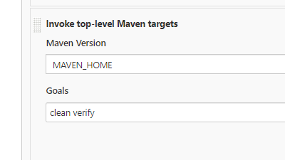
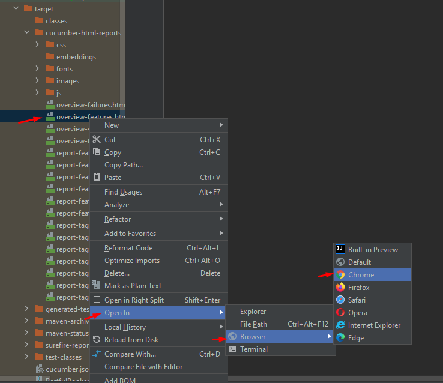
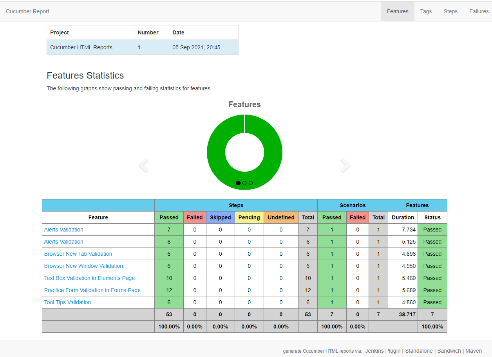

ToolsQA Test Automation

Tech Stack: Java, JUnit, Maven, Cucumber

**How to run?**
* Open command prompt and go to application folder
* Write "mvn clean verify" and hit enter
* If you want to run specific feature, get the feature tag and set it into tags in TestRunner class

**How to run with Jenkins?**
* Create a job and set Maven targets as "clean verify"

**Report**
* After running the application, it generates the report under the "target" folder
* Go to the target folder and open overview-features.html in any browser

* The report seems in the browser like:

**Calliope.pro link**
https://app.calliope.pro/reports/99789

**Scenarios Approach**
* They are chosen for test so that we can face them everytime in the websites.
* Scenarios are limited, but they will be more in the future
